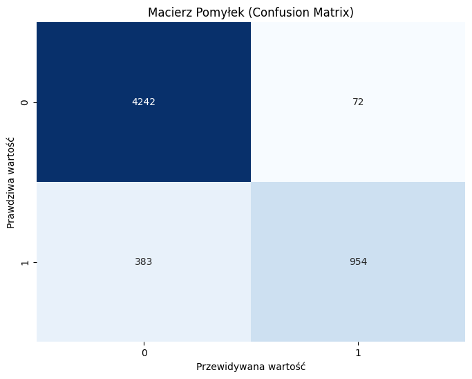
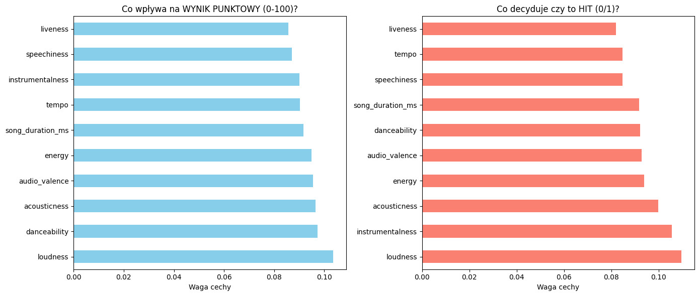

# 🎵 Predykcja popularności piosenek na podstawie cech audio

Praca inżynierska (Analiza Danych, Wydział Matematyki i Informatyki, Uniwersytet Łódzki, 2026) porównująca skuteczność pięciu rodzin algorytmów uczenia maszynowego w przewidywaniu, czy dany utwór muzyczny stanie się hitem, na podstawie jego cech akustycznych (m.in. głośność, taneczność, energia, instrumentalność).

> 📄 Pełna treść pracy: [`praca_inzynierska.pdf`](./praca_inzynierska.pdf)



## 🎯 Cel projektu

Zaprojektowanie i ewaluacja modeli klasyfikujących utwory jako **hit / nie-hit** na podstawie cech audio (m.in. ze zbioru Spotify), oraz porównanie tego podejścia z bezpośrednią regresją wartości popularności (0–100).

Kluczowa decyzja projektowa: transformacja zadania regresji w klasyfikację binarną z progiem `song_popularity >= 0.70`, ponieważ modele regresyjne (R² ≈ 0.39) nie były w stanie precyzyjnie wyjaśnić wariancji popularności, a klasyfikacja "hit / nie-hit" lepiej odpowiada realnym potrzebom biznesowym branży muzycznej.

## 🗂️ Struktura repozytorium

| Plik / folder | Opis |
|---|---|
| `notebook.ipynb` | Pełny pipeline: EDA, preprocessing, trening i porównanie 5 rodzin modeli, ewaluacja, eksport modelu |
| `dane.csv` | Zbiór danych – cechy audio i popularność ~18.8k utworów |
| `requirements.txt` | Zależności Pythona |
| `img/` | Wykresy i zrzuty ekranu wykorzystane w pracy i README |
| `praca_inzynierska.pdf` | Pełny tekst pracy inżynierskiej |

## 🧪 Metodologia

1. **Preprocessing:** usunięcie braków danych, selekcja cech numerycznych, skalowanie Min-Max.
2. **Inżynieria cech:** dyskretyzacja zmiennej celu (`klasyfikator = 1` gdy `song_popularity ≥ 0.70`).
3. **Modelowanie:** porównano 5 rodzin algorytmów, każdy ze strojeniem hiperparametrów (`GridSearchCV` / `RandomizedSearchCV` + 5-fold cross-validation):
   - Regresja Logistyczna (baseline liniowy)
   - K-Najbliższych Sąsiadów (KNN, z redukcją wymiarów PCA)
   - Random Forest
   - XGBoost
   - Sieć neuronowa (MLP)
4. **Ewaluacja:** Accuracy, Precision, Recall, F1, AUC-ROC — osobno dla zbioru treningowego i testowego (80/20).
5. **Walidacja jakościowa:** studium przypadku na 3 rzeczywistych utworach o różnej charakterystyce.

## 📊 Wyniki

| Model | AUC (test) | Accuracy (test) | Charakterystyka |
|---|---|---|---|
| Regresja Logistyczna | 0.685 | 0.685 | Model liniowy (baseline) |
| Sieć Neuronowa (MLP) | 0.633 | 0.633 | Nieliniowy, "czarna skrzynka" |
| XGBoost | 0.887 | 0.834 | Boosting gradientowy |
| K-Najbliższych Sąsiadów | – | ≈0.90 | Odległościowy, z PCA |
| **Random Forest** | **0.911** | **0.920** | **Bagging — model finalny** |

**Model finalny: Random Forest** (`n_estimators=200`, `class_weight='balanced_subsample'`) osiągnął dokładność **91.95%** i precyzję **0.93** dla klasy "hit" — oznacza to, że gdy model typuje utwór jako przebój, myli się jedynie w ~7% przypadków.



Najsilniejszymi predyktorami popularności okazały się **głośność (loudness)**, **instrumentalność** oraz **akustyczność** — co koreluje ze zjawiskiem tzw. *Loudness War* we współczesnej produkcji muzycznej.

## 🔍 Studium przypadku

Model przetestowano na rzeczywistych utworach o odmiennej charakterystyce:

| Utwór | Predykcja | Trafność |
|---|---|---|
| "I Like It" (Cardi B, Bad Bunny, J Balvin) | HIT (95%) | ✅ Zgodna ze współczesnymi trendami streamingowymi |
| "Wind of Change" (Scorpions) | Nie-hit | ⚠️ False Negative — model faworyzuje głośniejsze, bardziej taneczne produkcje, co jest niekorzystne dla starszych, spokojniejszych utworów |
| "Don't Change" (utwór niszowy) | Nie-hit | ✅ Zgodna z rzeczywistą niską popularnością |

Przypadek "Wind of Change" ujawnia ograniczenie modelu: silne obciążenie w kierunku współczesnych standardów produkcji (temporal bias), które warto zaadresować w dalszych pracach.

## 🚀 Uruchomienie lokalne

```bash
git clone https://github.com/szymonp311203/song-popularity-prediction
cd song-popularity-prediction
pip install -r requirements.txt
jupyter notebook notebook.ipynb
```

Notebook otworzy się w przeglądarce — uruchom komórki po kolei (`Shift + Enter`) lub użyj **Run All**. Uwaga: komórki ze strojeniem hiperparametrów (`RandomizedSearchCV` dla Random Forest, XGBoost i MLP) mogą trwać po kilka minut każda.

## 🛠️ Technologie

Python · pandas · scikit-learn · XGBoost · matplotlib / seaborn · Jupyter Notebook

## 📌 Ograniczenia i dalsze kierunki

- Brak analizy warstwy tekstowej utworów (NLP na tekstach piosenek)
- Obciążenie czasowe (temporal bias) — model faworyzuje współczesne standardy produkcji
- Potencjał do rozwinięcia w kierunku Deep Learning (analiza spektrogramów, CNN)

## 👤 Autor

Szymon Pawłowski — praca inżynierska, kierunek Analiza Danych, Uniwersytet Łódzki, 2026
Promotor: dr Marta Lipnicka, Katedra Sztucznej Inteligencji i Analizy Nieliniowej

## 📄 Licencja

Brak zdefiniowanej licencji — wszystkie prawa zastrzeżone.
